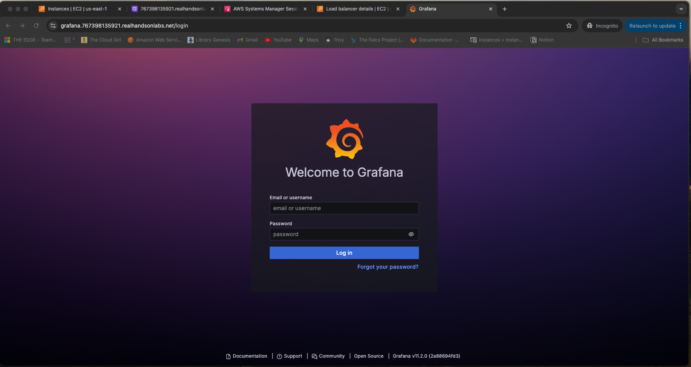
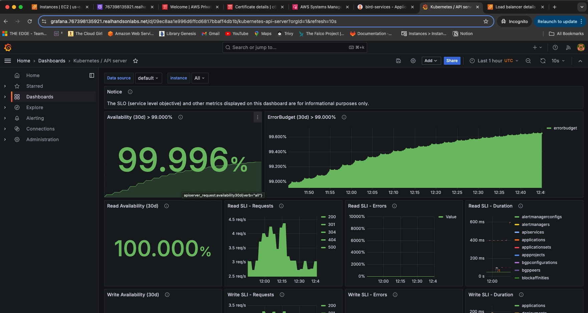
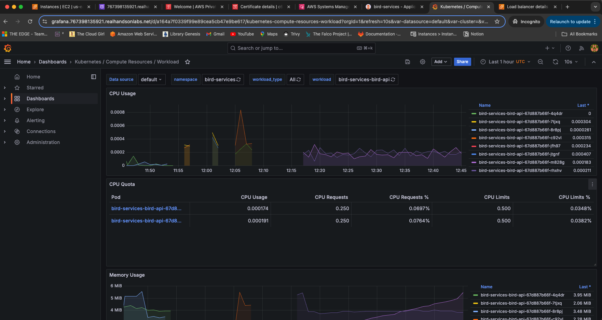
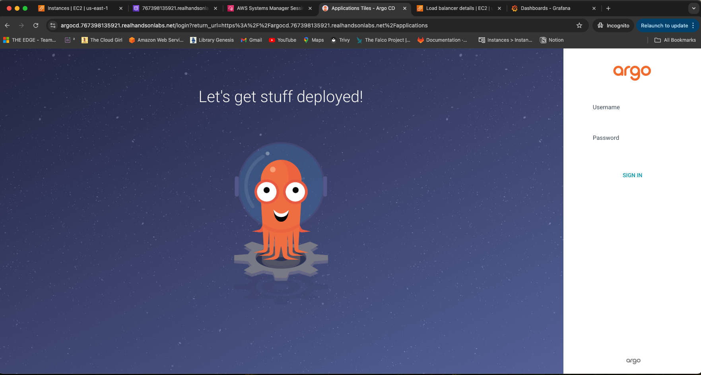
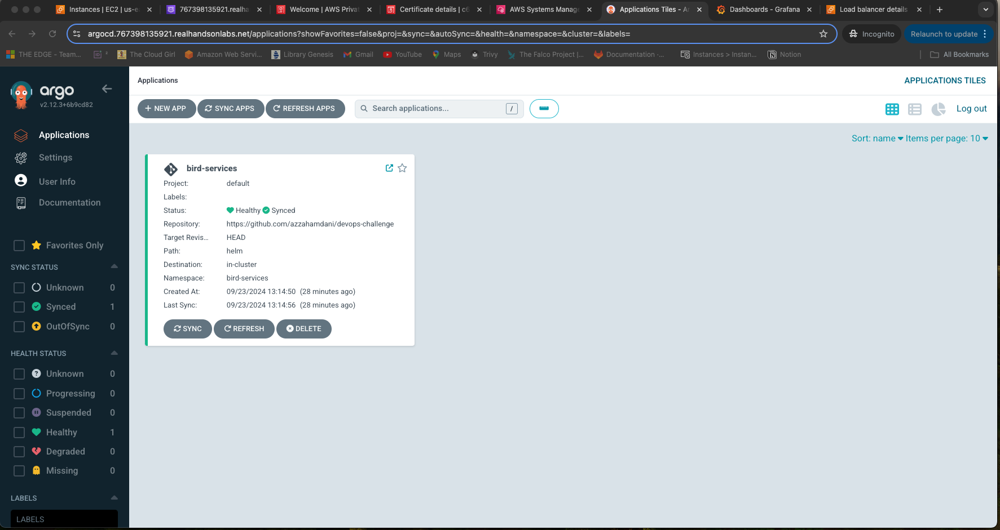
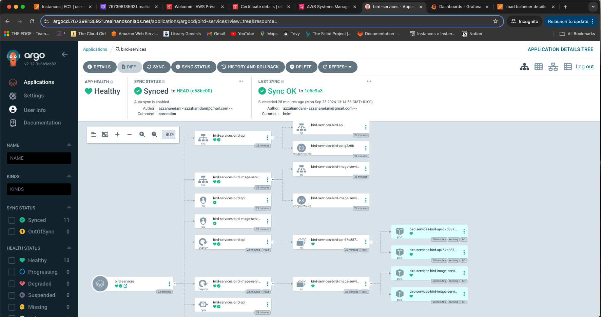
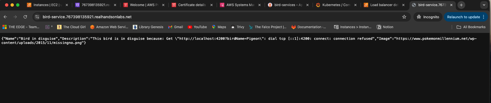

# DevOps Challenge: Cloud Infrastructure and Custom Kubernetes Configuration

## Table of Contents

## Table of Contents

1. [Project Overview](#project-overview)
2. [Architecture Overview](#architecture-overview)
3. [Prerequisites](#prerequisites)
4. [Step-by-Step Guide](#step-by-step-guide)
   - [Infrastructure Setup](#infrastructure-setup)
   - [Accessing the Control Plane](#accessing-the-control-plane)
   - [Cluster Configuration](#cluster-configuration)
   - [Load Balancer Controller Installation](#load-balancer-controller-installation)
   - [TLS Certificate Configuration](#tls-certificate-configuration)
   - [Prometheus Observability Setup](#prometheus-observability-setup)
   - [GitOps with ArgoCD](#gitops-with-argocd)
   - [Bird Application Deployment](#bird-application-deployment)
5. [Verification and Monitoring](#verification-and-monitoring)
6. [Troubleshooting](#troubleshooting)
7. [Security Considerations](#security-considerations)
   - [Current Security Measures](#current-security-measures)
   - [Areas for Enhancement](#areas-for-enhancement)
8. [Scaling and Performance](#scaling-and-performance)
   - [Application-Level Scaling](#application-level-scaling)
   - [Node-Level Scaling](#node-level-scaling)
   - [Cluster-Level High Availability and Performance](#cluster-level-high-availability-and-performance)
9. [Observability Considerations and Next Steps](#observability-considerations-and-next-steps)
   - [Current Implementation](#current-implementation)
   - [Areas for Enhancement](#areas-for-enhancement-1)
10. [Conclusion](#conclusion)

## Project Overview

This DevOps challenge aims to demonstrate the setup and configuration of a robust, scalable, and secure cloud infrastructure on AWS. The project showcases the implementation of a custom Kubernetes cluster, along with essential components for networking, observability, and GitOps practices. This setup provides a solid foundation for deploying and managing containerized applications in a production-like environment.

Key features of this project include:
- Custom Kubernetes cluster provisioned on EC2 instances
- Networking configuration with CNI and Load Balancer
- Observability stack with Prometheus and Grafana
- GitOps workflow using ArgoCD
- Secure communication with TLS certificates

## Architecture Overview

Our infrastructure consists of the following components:

1. **Cloud Infrastructure**:
   - AWS VPC with public and private subnets
   - Security groups and IAM roles for EC2 instances

2. **Kubernetes Cluster**:
   - Custom K8s cluster provisioned on EC2 instances
   - Master Node: Single EC2 instance serving as the control plane
   - Worker Nodes: EC2 Auto Scaling group with 3 initial instances

3. **Networking**:
   - Container Network Interface (CNI) plugin for pod networking
   - AWS Load Balancer Controller for managing ALBs/NLBs

4. **Observability**:
   - Prometheus for metrics collection
   - Grafana for visualization and dashboards

5. **GitOps**:
   - ArgoCD for declarative, Git-based delivery of Kubernetes resources

6. **Security**:
   - TLS certificates managed by AWS Certificate Manager (ACM)
   - Secure communication between components and external access

## Prerequisites

Before starting this project, ensure you have the following:

- AWS account with appropriate permissions
- AWS CLI configured with your credentials
- Terraform installed (used version v1.9.5)
- kubectl installed
- Helm installed (version 3.x)
- Git client

## Step-by-Step Guide

### 1. Infrastructure Setup

This step uses Terraform to provision the foundational AWS infrastructure.

```bash
cd terraform
terraform init
terraform validate
terraform plan
terraform apply
```

Key resources created:
- VPC with public and private subnets
- Security groups
- IAM roles and policies
- EC2 instances for Kubernetes nodes

### 2. Accessing the Control Plane

Access the master node (control plane) using AWS Systems Manager (SSM) for cluster management.

```bash
# List instances with SSM capability
aws ssm describe-instance-information --query 'InstanceInformationList[*].[InstanceId, PingStatus]'

# Start SSM session (replace with your instance ID)
aws ssm start-session --target i-1234567890abcdef0
```

Verify cluster access:
```bash
kubectl get nodes
```

Source bashrc

### 3. Cluster Configuration

Configure the Kubernetes cluster with CNI and set up worker nodes.

```bash
git clone https://github.com/azzahamdani/devops-challenge.git
cd devops-challenge/scripts

# Configure CNI
chmod +x ./control-plane-cni.sh
./control-plane-cni.sh

# Configure worker nodes
chmod +x nodes-configure.sh
./nodes-configure.sh
```

This step ensures proper network configuration and node registration within the cluster.

### 4. Load Balancer Controller Installation

Install the AWS Load Balancer Controller to manage ALB/NLB resources.

```bash
chmod +x alb-controller-configure.sh
./alb-controller-configure.sh
```

This controller allows Kubernetes to interact with AWS load balancing services, enabling external access to services.

### 5. TLS Certificate Configuration

Set up TLS certificates using AWS Certificate Manager (ACM) for secure communications.

```bash
chmod +x certificate-configure.sh
./certificate-configure.sh
```

> **Note** I utilized a pre-registered DNS name in a Public Hosted Zone on Route 53, as the project is being run on a limited cloud instance for learning purposes. 
Having a Route 53 DNS name is a prerequisite for this setup.

This step ensures encrypted traffic between clients and the cluster services.

### 6. Prometheus Observability Setup

Install and configure Prometheus and Grafana for cluster monitoring and visualization.

```bash
chmod +x prometheus-configure.sh
./prometheus-configure.sh
```

To access the Grafana UI, use the following default credentials:

- **Username:** admin
- **Password:** prom-operator

**Important:** For security reasons, it is highly recommended to change these credentials during your first login. The default credentials are stored in the `values.yaml` file, which poses a potential security risk if not updated.

This observability stack provides insights into cluster performance, resource utilization, and application metrics.

<div align="center">
  
  <p><em>GrafanaLogin</em></p>
</div>

<div align="center">
  
  <p><em>GafanaDashbord KubeAPI</em></p>
</div>

<div align="center">
  
  <p><em>GrafanaDashbord Bird APP</em></p>
</div>


### 7. GitOps with ArgoCD

Set up ArgoCD to implement GitOps practices for managing Kubernetes resources.

```bash
chmod +x argocd-configure.sh
./argocd-configure.sh
```

To access the ArgoCD GitOps UI, please use the following credentials:

<div align="center">
  
  <p><em>ArgoCD Login</em></p>
</div>

- **Username:** admin
- **Password:** The password will be provided at the end of the script execution. Please make sure to use it.

**Note:** It is crucial to change the default password immediately upon logging in. The password is stored in a Kubernetes Secret encoded in Base64 (without HSM protection), which poses a security risk if not updated.

ArgoCD enables declarative, version-controlled application deployment and management.


### 8. Bird Application Deployment

Deploy the Bird application using ArgoCD to manage Helm releases. Follow these steps:

1. Make the configuration script executable:
   ```bash
   chmod +x bird-app-configure.sh
   ```

2. Run the script to set up the application:
   ```bash
   ./bird-app-configure.sh
   ```

3. Once the deployment is complete, use the URL provided in the script output to access the application from the internet.

<div align="center">
  
  <p><em>ArgoCD Application</em></p>
</div>

<div align="center">
  
  <p><em>ArgoCD Application 2</em></p>
</div>

<div align="center">
  
  <p><em>Application</em></p>
</div>

## Verification and Monitoring

After completing the setup, verify the deployment:

1. Check node status: `kubectl get nodes`
2. Verify pod status: `kubectl get pods --all-namespaces`
3. Access Grafana dashboards for cluster metrics
4. Log into ArgoCD UI to manage application deployments


## Security Considerations and Next Steps

### Current Security Measures
1. Network Security:
   - Master Node and Worker Node are placed in Private Subnets with No Inbound Internet Access.
   - AWS Systems Manager (SSM) is configured for secure operational access.

2. Deployment Strategy:
   - GitOps with ArgoCD is implemented for pulling changes on app versions packaged with Helm.
   - This strategy eliminates the need for inbound internet access, enhancing security compared to traditional CI/CD release strategies.

3. Network Policies:
   - The packaged Helm charts support Network Policies.
   - Further updates are required to fine-tune allowed traffic between services.

4. Cloud Security:
   - Basic cloud security measures have been implemented.

### Areas for Enhancement

#### Container and Kubernetes Security
1. Regular Updates and Patching:
   - Implement a systematic process for updating and patching all components, including:
     - Kubernetes cluster
     - Container images
     - Host operating systems
   - Use tools like Trivy or Clair for container image scanning.

2. Network Policy Implementation:
   - Enhance existing Network Policies (implemented in Helm) to:
     - Control pod-to-pod communication
     - Implement the principle of least privilege for network access

3. Role-Based Access Control (RBAC):
   - Implement and regularly review RBAC policies to manage access to Kubernetes resources.
   - Ensure principles of least privilege and separation of duties.

4. Audit Logging:
   - Enable comprehensive audit logging for cluster activities.
   - Implement a centralized log management solution (e.g., ELK stack, Splunk) for log analysis and alerting.

5. Secrets Management:
   - Implement a robust secrets management solution such as:
     - AWS Secrets Manager
     - HashiCorp Vault
   - Ensure encryption of secrets at rest and in transit.

### Application-Level Security
1. Secure Coding Practices:
   - Implement and enforce secure coding guidelines.
   - Conduct regular code reviews and static code analysis.

2. Dependency Management:
   - Regularly scan and update application dependencies.
   - Use tools like OWASP Dependency-Check or Snyk.

3. API Security:
   - Implement API authentication and authorization.
   - Use rate limiting and input validation for all API endpoints.

## Scaling and Performance Considerations

### Current Implementation

1. Application Scaling:
   - Helm chart for Bird application supports Horizontal Pod Autoscaler (HPA).
   - Metrics server needs to be deployed to enable HPA functionality.

2. Node Scaling:
   - Nodes have been deployed in an Auto Scaling Group, laying the groundwork for Cluster Autoscaler implementation.

3. Master Node Configuration:
   - Currently deployed in single mode.

### Areas for Enhancement

#### 1. Application-Level Scaling

a) Deploy Metrics Server:
   - Install and configure Metrics Server to provide resource metrics for HPA.

b) Implement Horizontal Pod Autoscaler (HPA):
   - Configure HPA for the Bird application using the existing support in the Helm chart.
   - Set appropriate minimum and maximum replicas, and resource utilization targets.

c) Enhance HPA with Custom Metrics:
   - Deploy Prometheus for collecting custom metrics.
   - Configure Prometheus Adapter to expose these metrics to the HPA.
   - Update HPA configuration to use custom metrics, such as requests per second.

#### 2. Node-Level Scaling

a) Implement Cluster Autoscaler:
   - Deploy Cluster Autoscaler to automatically adjust the number of nodes based on resource demands.
   - Configure Cluster Autoscaler to work with the existing Auto Scaling Group.

b) Fine-tune Auto Scaling policies:
   - Adjust scaling thresholds based on application performance requirements.
   - Implement scale-out and scale-in policies to handle varying workloads efficiently.

### 3. Cluster-Level High Availability and Performance

a) Implement High Availability for Master Nodes:
   - Transition from single-mode to multi-master setup for improved reliability.
   - Deploy at least three master nodes across different availability zones.
   - Use a load balancer to distribute API server traffic.

b) ETCD Performance Optimization and Disaster Recovery:
   - Implement regular ETCD backups.
   - Set up a disaster recovery plan for ETCD, including off-site backup storage and restoration procedures.
   - Monitor ETCD performance using Prometheus and Grafana, with alerts for key metrics.

c) Optimize ETCD Performance:
   - Ensure ETCD runs on high-performance SSD storage.
   - Fine-tune ETCD parameters based on cluster size and workload, including quota and compaction settings.

## Observability Considerations 

### Current Implementation

1. Logging:
   - Application logging has been enhanced for improved visibility.

2. Metrics:
   - Prometheus has been installed to collect basic pod and Kubernetes metrics.
   - Grafana has been set up for metrics visualization.

### Areas for Enhancement

#### 1. Application Instrumentation

a) Metrics Instrumentation:
   - Instrument the application to emit custom metrics.
   - Consider using libraries compatible with Prometheus for easy integration (e.g., prometheus-client for Python, micrometer for Java).
   - Define and implement key performance indicators (KPIs) specific to the Bird application.

b) Tracing Instrumentation:
   - Implement distributed tracing in the application.
   - Use OpenTelemetry or a similar framework for standardized tracing instrumentation.
   - Ensure all critical paths and external service calls are properly traced.

#### 2. Observability Stack Enhancement

a) Log Aggregation:
   - Install and configure Loki for centralized log management.
   - Enhance the Helm chart to support sending application logs to Loki.
   - Set up log retention policies and indexing for efficient querying.

b) Distributed Tracing:
   - Deploy Jaeger for end-to-end distributed tracing.
   - Configure the Helm chart to enable trace collection from the application.
   - Set up appropriate sampling rates and retention periods for traces.

c) Metrics Expansion:
   - Extend Prometheus configuration to scrape custom application metrics.
   - Set up recording rules and alerts for critical metrics.
   - Create comprehensive Grafana dashboards that include both system and application-specific metrics.

#### 3. Integration and Correlation

a) Unified Observability:
   - Implement links between metrics, logs, and traces for easier problem investigation.
   - Consider using a tool like Grafana Tempo for trace-to-logs and trace-to-metrics capabilities.

b) Alert Correlation:
   - Set up intelligent alerting that correlates metrics, logs, and traces.
   - Implement alert deduplication and grouping to reduce noise.

#### 4. Observability as Code

a) Helm Chart Enhancement:
   - Update the Helm chart to include all observability components (Prometheus, Loki, Jaeger).
   - Implement configurable values for easy customization of the observability stack.

b) Dashboard as Code:
   - Version control Grafana dashboards using tools like grafonnet.


## Conclusion

This project demonstrates a comprehensive approach to setting up a production-ready Kubernetes environment on AWS. By following these steps and best practices, you've created a scalable, observable, and manageable infrastructure suitable for hosting containerized applications.

Remember to continually monitor, optimize, and update your infrastructure to maintain its efficiency and security. As your needs evolve, consider exploring advanced topics such as service mesh implementation, advanced networking policies, or multi-cluster deployments.
